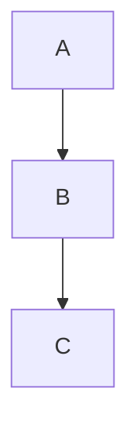

## 1. Summary

Mermaid extension for Python-Markdown to add support for Mermaid graphs inside Markdown file.

## 2. Installation

```shell
pip install markdown
pip install git+https://github.com/Kristinita/md_mermaid.git@KiraMermaidWorking
```

## 3. Usage

````python
import markdown

text = """
# Title

Some text.



Some other text.

~~~mermaid
graph TB
D --> E
E --> F
~~~

"""

html = markdown.markdown(text, extensions=['md_mermaid'])

print(html)
````

> [!TIP]
> Pay attention that extension name is `md_mermaid`, not `md-mermaid`.

Output:

```html
<h1>Title</h1>
<p>Some text.</p>
<pre class="mermaid">
graph TB
A --> B
B --> C
</pre>

<p>Some other text.</p>
<pre class="mermaid">
graph TB
D --> E
E --> F
</pre>
```

Don’t forget to include in your output HTML project 2 following Mermaid files:

1. `mermaid.css` (optional, can be customized)
1. `mermaid.min.js` (can be fetched [**on JSDelivr**](https://cdn.jsdelivr.net/npm/mermaid/dist/mermaid.min.js))
